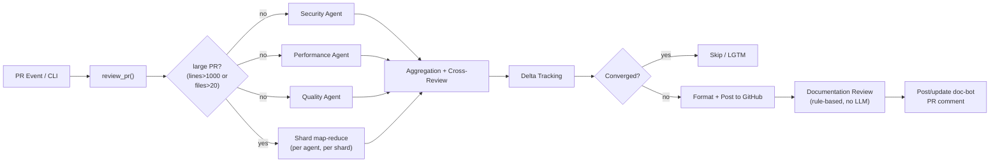
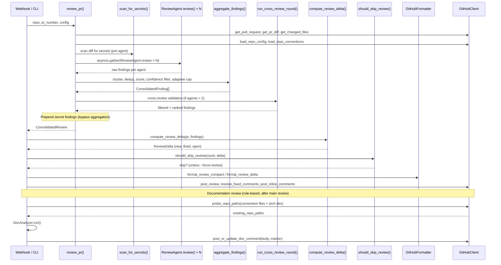
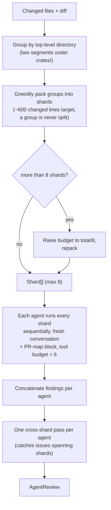
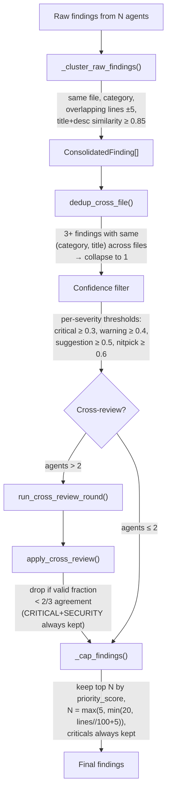
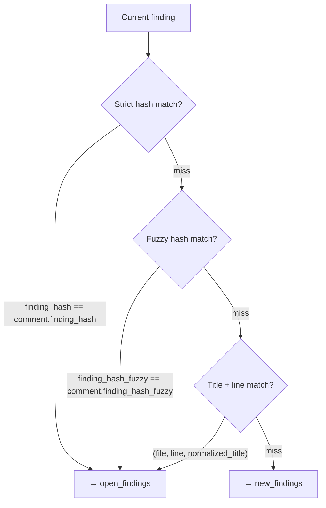
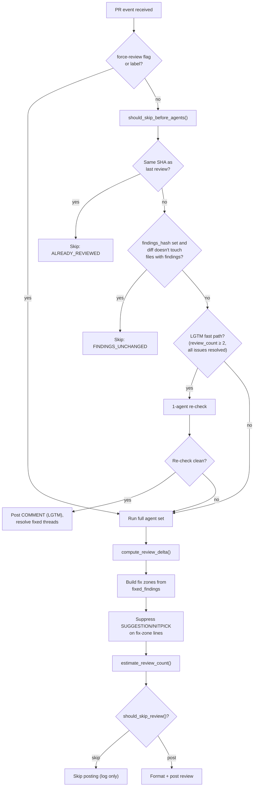
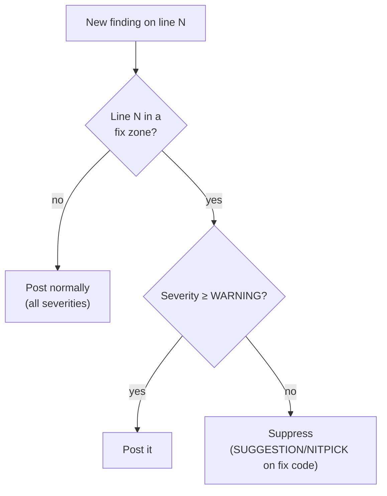
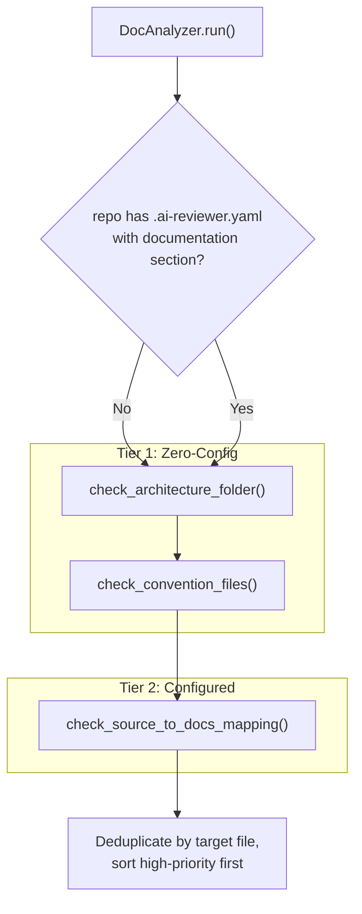

# Architecture Documentation

> Comprehensive technical reference for the AI Code Reviewer system.
> For a quick overview, see the [README](../README.md).
>
> **2026-04 migration notice:** the LLM backend moved from the Cursor
> Background Agent API to Anthropic's Messages API (official `anthropic`
> SDK). The orchestration entry point is `review_pr()` (the old
> `review_pr_with_cursor_agent` name has been removed), and per-agent
> execution flows through `ReviewAgent` subclasses and
> `AnthropicClient.run_review`. See
> [`docs/superpowers/specs/2026-04-15-anthropic-messages-migration-design.md`](superpowers/specs/2026-04-15-anthropic-messages-migration-design.md)
> for the full migration design.

## Table of Contents

1. [System Overview](#1-system-overview)
2. [Review Pipeline](#2-review-pipeline)
3. [Multi-Agent Consensus](#3-multi-agent-consensus)
4. [Scoring System](#4-scoring-system)
5. [Incremental Review (Delta Tracking)](#5-incremental-review-delta-tracking)
6. [Convergence and "Stop Reviewing" Logic](#6-convergence-and-stop-reviewing-logic)
7. [Documentation Review](#7-documentation-review)
8. [Prompt Engineering](#8-prompt-engineering)
9. [Security](#9-security)

---

## 1. System Overview

AI Code Reviewer orchestrates multiple LLM agents — each with a specialized focus area — to produce consensus-based code reviews. All LLM access goes through Anthropic's Messages API via the official `anthropic` SDK. Review agents run on `claude-sonnet-5` (security-reviewer and logic-reviewer with adaptive extended thinking on; the other review agents run with thinking off), and the style agent runs on `claude-haiku-4-5`. Repo exploration happens through Claude tool use (`read_file` / `glob` / `grep`) backed by the GitHub Contents API.



### Module Map

| Module | Responsibility |
|--------|----------------|
| `cli.py` | Click CLI: `review-pr`, `config validate/show`, `serve` (uvicorn webhook) |
| `config.py` | YAML/env `Config` dataclasses, `load_config`, `validate_config` |
| `review.py` | Main pipeline: `review_pr`, PR classification, aggregation + adaptive finding cap, cross-review, language rules; `_build_shards` / `_run_agent_sharded` for the size-gated sharded map-reduce path on large PRs |
| `models/context.py` | `ReviewContext` dataclass for PR/repo metadata and repo config hooks |
| `models/findings.py` | `Severity`, `Category`, `ReviewFinding`, `ConsolidatedFinding`, `compute_fuzzy_hash` |
| `models/review.py` | `ReviewHistory`, `ScoreBreakdown`, `AgentReview`, `ConsolidatedReview` |
| `agents/anthropic_client.py` | `AnthropicClient`: Messages API wrapper with tool-use loop, adaptive thinking, JSON-schema structured output, prompt caching; `run_review` / `complete_simple` / `run_completion`. All calls stream via `messages.stream` + `get_final_message` to avoid dropped/corrupted long responses. Sole importer of the `anthropic` SDK (invariant I1) |
| `agents/base.py` | `ReviewAgent` base class; drives `AnthropicClient.run_review` per agent (model from config, falling back to class `MODEL`) |
| `agents/security.py` | `SecurityAgent`, `AuthenticationAgent` (Sonnet) |
| `agents/performance.py` | `PerformanceAgent`, `LogicAgent` (Sonnet) |
| `agents/patterns.py` | `PatternsAgent` (Sonnet), `StyleAgent` (Haiku) |
| `context/builder.py` | `build_system_blocks` (review standard + few-shot + PR-tuning + language-priority blocks), `build_user_blocks`, `FINDINGS_SCHEMA` |
| `context/fetch.py` | `fetch_conventions`, `build_repo_map` (GitHub Contents API, budget-aware) |
| `context/neighbors.py` | Import-graph / sibling heuristics; `parse_imports_by_path` for Python/TS/JS/Go/Rust/Java |
| `tools/repo_tools.py` | `ToolRegistry` exposing `read_file`/`glob`/`grep` for Claude tool use; results returned to the model are capped at `max_tool_result_bytes` (16KB default), with a "narrow your search" marker on truncation |
| `session.py` | `ReviewSession` — per-review GitHub quota + file/tree caches + tool counters |
| `orchestrator/orchestrator.py` | Generic parallel `AgentOrchestrator` (asyncio tasks) |
| `orchestrator/aggregator.py` | `ReviewAggregator` clustering/merge (alternate path; production uses `aggregate_findings` in `review.py`) |
| `security/scanner.py` | Regex + Shannon entropy secret scanner on unified diffs |
| `github/client.py` | `GitHubClient`, delta/convergence, inline comments, metadata, thread resolution, doc-bot comment upsert, repo path probing |
| `github/formatter.py` | `GitHubFormatter`: markdown bodies, compact/delta layouts, review actions, JSON export |
| `github/webhook.py` | FastAPI app, HMAC verification, PR + `/ai-review` comment handlers |
| `docs/__init__.py` | Package init for documentation review module |
| `docs/analyzer.py` | `DocAnalyzer`, `is_architecture_impacting`, `_apply_html_patches` (whitespace-tolerant HTML patcher), `format_doc_comment` — rule-based doc review |
| `docs/models.py` | Doc-update pipeline contracts: `Change`, `ChangeSummary`, `DocAction`, `DocDraft`, `FileWrite`, `Verdict`, `extract_json` |
| `docs/understanding.py` | Stage 1 — `summarize_pr_changes` (full-PR → `ChangeSummary`; map-reduce for large diffs) |
| `docs/router.py` | Stage 2 — `route_changes` (map each change to update_section / add_section / create_page) |
| `docs/apply.py` | Stage 3 — `apply_update_section`, `apply_add_section` (FIND/REPLACE + card insertion) |
| `docs/page_builder.py` | Stage 3 — `apply_create_page`, `wire_new_pages` (new page from sibling + nav/index wiring, orphan guard) |
| `docs/verify.py` | Stage 4 — `verify_draft` (confidence gate: flag, don't ship) |
| `docs/updater.py` | `run_doc_update` orchestrator: Understand → Route → Apply → Verify → open PR (or flag) |

---

## 2. Review Pipeline

### Entry Points

| Entry | Function | Path |
|-------|----------|------|
| **CLI** | `review_pr` → `review_pr_async()` | `cli.py` |
| **Webhook** | `handle_pr_event` → `run_review` (inline) or Cloud Tasks | `github/webhook.py` |
| **Serve** | `cli serve` starts uvicorn with the webhook app | `cli.py` |

#### Durable review jobs (Cloud Tasks)

Running reviews inline in the webhook request collapses the instance's streaming connections under bursts of PRs across repos.
When `TASK_QUEUE_PATH` and `TASK_TARGET_URL` are set the webhook becomes a thin enqueuer and reviews run as durable, retryable Cloud Tasks jobs (unset = inline mode, the local/CI fallback).

Flow: `webhook -> enqueue_review -> Cloud Tasks (retry/backoff, max-concurrent-dispatches) -> POST /process-review -> run_review`.

`/process-review` authenticates via `X-Task-Auth` (fails closed if `TASK_AUTH_TOKEN` is unset), dedups on `head_sha` against the last posted review metadata, and returns 500 to trigger a retry on transient failure.
On the final attempt (`TASK_MAX_ATTEMPTS`, default 4) it posts a visible "Review could not complete" comment and emits a `review-job-dead repo=... pr=... sha=... error=...` log line for replay, then returns 200 to terminate the task.

Provision the queue:

```bash
gcloud tasks queues create ai-review-jobs --location=europe-west3 --max-concurrent-dispatches=2 --max-attempts=4 --min-backoff=60s --max-backoff=600s
```

Then set on the service (in addition to the existing review env): `TASK_QUEUE_PATH=projects/<P>/locations/<L>/queues/ai-review-jobs`, `TASK_TARGET_URL=https://<this-service-url>`, `TASK_AUTH_TOKEN=<shared secret>`, and optionally `TASK_MAX_ATTEMPTS=4` (match the queue's `--max-attempts`).

### Sequence Diagram



### Key Functions

- **`review_pr()`** (`review.py`): Core orchestration. Fetches PR data, builds context, spawns agents in parallel, aggregates, cross-reviews, prepends secret findings, returns `ConsolidatedReview`. On large PRs (additions + deletions > 1000 or changed files > 20), agents run through the sharded map-reduce path (`_run_agent_sharded`) instead of a single conversation - see [Large-PR Sharded Review](#large-pr-sharded-review) below.
- **`ReviewAgent.review()`** (`agents/base.py`): Runs one agent via `AnthropicClient.run_review` (tool-use loop + structured output), returns an `AgentReview`. The model is the configured `AgentConfig.model`, falling back to the agent class's `MODEL`.
- **`aggregate_findings()`** (`review.py`): Clusters raw findings by similarity, computes consensus scores, applies confidence filtering, cross-file dedup, and an adaptive per-review finding cap (`_cap_findings`).
- **`run_review()`** (`webhook.py`): The webhook's review flow — pre-agent skip checks, LGTM fast path, metadata embedding, and the full post flow. Raises on failure so the Cloud Tasks worker (`/process-review`) can retry; the inline path wraps it in `default_review_handler` and swallows exceptions for best-effort behavior.

---

## 3. Multi-Agent Consensus

### Agent Spawning

Production uses **parallel `asyncio.gather`** of `ReviewAgent.review()`, one per agent. Agents are resolved from the `_AGENT_CLASSES` registry (configurable via `.ai-reviewer.yaml`; default order in `DEFAULT_AGENT_ORDER` is security-reviewer, logic-reviewer, patterns-reviewer, performance-reviewer, style-reviewer, so `--agents 3` with no repo config runs security + logic + patterns):

| Agent class | `AGENT_TYPE` | Model | Focus |
|-------------|--------------|-------|-------|
| `SecurityAgent` | `security-reviewer` | Sonnet 5 + thinking | OWASP Top 10, injection, auth, crypto, secrets |
| `AuthenticationAgent` | `authentication-reviewer` | Sonnet 5 | AuthN/AuthZ, session/token handling |
| `PerformanceAgent` | `performance-reviewer` | Sonnet 5 | Algorithmic complexity, resource leaks, concurrency |
| `LogicAgent` | `logic-reviewer` | Sonnet 5 + thinking | Correctness, edge cases, error handling, concurrency/CRDT/DAG invariants |
| `PatternsAgent` | `patterns-reviewer` | Sonnet 5 | Consistency, SOLID, anti-patterns, architecture |
| `StyleAgent` | `style-reviewer` | Haiku | Readability, naming, docs (nitpick-tier) |

Agent count is adaptive: `_effective_agent_count()` scales the number of agents to PR size. Cross-review is auto-skipped when ≤ 2 agents run. When a single agent runs (small PR) it is instructed to cover all perspectives. When cross-review is skipped, the confidence filter falls back to the conservative floor set, since the cross-review precision gate isn't there to catch false positives.

- **Thinking policy**: `claude-sonnet-5` only supports adaptive thinking. security-reviewer and logic-reviewer run with `thinking_enabled=true`, `max_tokens=32000`, and `output_config.effort="medium"` (so thinking doesn't starve the findings JSON). patterns/performance/style run with thinking off.
- **Tool-loop drop**: on the final tool round, `AnthropicClient.run_review` stops offering tools, forcing the agent to emit its findings JSON instead of exiting empty behind a "tool loop cap" marker (which previously discarded the whole review).
- **Circuit breaker**: before each request, `AnthropicClient.run_review` checks the *last* request's true context size - input + cache_read + cache_creation tokens, taken from the API's own per-response usage - against `2 × max_combined_context_tokens`. If it's already over the limit, the loop aborts and returns the `CIRCUIT_BREAKER_MARKER` summary instead of sending a request that will fail server-side. This replaced measuring cumulative uncached `input_tokens`, which excludes cache reads and so never tripped once prompt caching engaged.
- **Tool result cap**: results returned to the model through `ToolRegistry` are truncated to `max_tool_result_bytes` (16KB default) with a "narrow your search" marker; the 512KB `per_file_max_bytes` cap on the underlying GitHub fetch is separate and unchanged.

### Cross-Agent Prompt Caching

`build_system_blocks` produces a `[system][shared user]` prefix that is identical across every agent in a review - only the per-agent role prompt differs. `ReviewAgent._build_user_blocks` appends that role prompt as the **last** block of the user turn (not `system` block[0]), with the cache breakpoint (`cache_control: ephemeral`) placed on the last *shared* block, right before the role block. Because the cacheable prefix is now byte-identical across agents, the first agent's request cache-writes the shared ~80k-token context and every other agent's parallel request cache-reads it, instead of each agent paying full price for its own copy.

### Large-PR Sharded Review

PRs above a size gate (`additions + deletions > 1000` or `changed_files_count > 20`, `review.py` `_SHARD_LINE_GATE` / `_SHARD_FILE_GATE`) skip the single-conversation path above and instead run through `_run_agent_sharded`. This exists because a single ever-growing conversation on a large PR drives per-request context to ~130-160k tokens, which trips server-side "Grammar compilation timed out" errors.



- **`_build_shards()`**: groups changed files by top-level directory (directories under `crates/` split on their first two path segments), then greedily packs groups into shards up to `_SHARD_TARGET_LINES` (600) changed lines, never splitting a group. If packing produces more than `_SHARD_MAX` (8) shards, the budget is raised to `total_lines / _SHARD_MAX` and repacked. Deterministic: groups and shards are both ordered by their alphabetically-first path.
- **`build_pr_map_block()`** (`context/builder.py`): a compact whole-PR digest - totals plus one line per file with `(+adds/-dels)` and the function/impl/class symbols scraped from that file's diff hunk headers - given to every shard so an agent reviewing one directory still has visibility into the shape of the rest of the PR.
- **Per-shard execution**: each shard gets its own fresh conversation (no shared history across shards) with a reduced tool budget of `_SHARD_TOOL_BUDGET` (6) calls, plus the PR-map block appended to its user blocks.
- **Failure handling**: a shard that raises or returns an incomplete-marker summary is recorded as a coverage gap and skipped; the agent as a whole only fails if every shard fails. A successful agent's summary gets a "Coverage gap: shard(s) ... failed" note appended when any shard failed.
- **Cross-shard pass** (`_run_cross_shard_pass`): one extra LLM call per agent, given the PR map plus all findings gathered across that agent's shards, looking only for cross-cutting issues no single shard could see (a signature changed in one directory with a stale caller in another, a moved definition, etc.). Non-fatal - a failure here is logged and doesn't affect the agent's other findings.
- Small and medium PRs are unaffected and keep the existing single-conversation path.

### Aggregation Pipeline



The thresholds above are the floors used when cross-review runs (≥ 3 effective agents). When cross-review is skipped (1-2 effective agents, small/medium PRs), the filter falls back to a conservative set: critical ≥ 0.5, warning ≥ 0.6, suggestion ≥ 0.7, nitpick ≥ 0.8.

**Clustering** (`_cluster_raw_findings`): Groups findings that share the same file, category, overlapping line ranges (±5 lines), and combined title+description similarity ≥ 0.85 (character-level `SequenceMatcher`). Each cluster becomes one `ConsolidatedFinding` with `consensus_score = unique_agents_in_cluster / total_agents`.

**Cross-file dedup** (`dedup_cross_file`): When 3+ findings share the same `(category, title)` across different files, they collapse into a single finding with an "Also found in: ..." annotation.

**Cross-review validation** (`run_cross_review_round` → `apply_cross_review`): A second-pass LLM call where agents validate each other's findings. Each validation call goes through `AnthropicClient.complete_simple()` (not the raw SDK — invariant I1) using the configured `default_model`. Findings with < 2/3 validation agreement are dropped — except `CRITICAL` severity + `SECURITY` category findings, which always bypass this filter.

**Adaptive finding cap** (`_cap_findings`): After dedup and cross-review, findings are ranked by `priority_score` (severity × consensus × confidence) and trimmed to the top `N = max(5, min(20, total_lines // 100 + 5))`, where `total_lines` is the PR's additions + deletions. `CRITICAL` findings are exempt and never dropped — the cap only trims non-criticals, so the final count can exceed `N` when there are many criticals. This bounds review noise on small PRs while preserving high-value findings.

---

## 4. Scoring System

### `compute_quality_score()`

Located in `review.py`. Returns a `float` between 0.0 and 0.95 along with a `ScoreBreakdown`.

#### When findings exist

```
severity_weights = {CRITICAL: 0.20, WARNING: 0.06, SUGGESTION: 0.02, NITPICK: 0.005}

severity_penalty = Σ (weight[f.severity] × f.confidence)  for each finding f
density_penalty  = min(0.15, (len(findings) / max(total_lines/100, 1)) × 0.03)
consensus_factor = 0.8 + mean(f.consensus_score) × 0.2
agent_factor     = min(1.0, agent_count / 3)

raw_score = max(0, 1 - severity_penalty - density_penalty)
final     = min(0.95, round(raw_score × consensus_factor × agent_factor, 2))
```

#### Clean review (no findings)

```
raw_score    = 0.85
agent_bonus  = max(0, min(0.10, (agent_count - 1) × 0.05))
agent_factor = (raw_score + agent_bonus) / raw_score
final        = min(0.95, raw_score × agent_factor)
```

### `ScoreBreakdown`

```python
@dataclass
class ScoreBreakdown:
    severity_penalty: float
    density_penalty: float
    consensus_factor: float
    agent_factor: float
    raw_score: float
```

Displayed in the review footer as a collapsed `<details>` section so reviewers can understand how the score was derived.

---

## 5. Incremental Review (Delta Tracking)

### `ReviewDelta`

```python
@dataclass
class ReviewDelta:
    new_findings: list[ConsolidatedFinding]       # Not seen before
    fixed_findings: list[PreviousComment]          # Previously reported, now resolved
    open_findings: list[ConsolidatedFinding]       # Still present from prior review
    previous_comments: list[PreviousComment]       # All prior AI review comments
    suppressed_findings: list[ConsolidatedFinding] # Low-severity on fix-zone lines

    @property
    def all_issues_resolved(self) -> bool:
        return len(self.open_findings) == 0 and len(self.new_findings) == 0
```

### Three-Tier Matching in `compute_review_delta()`

Each current finding is matched against previous inline comments using a three-tier cascade:



| Tier | Hash Key | Stable Across |
|------|----------|---------------|
| **Strict** | `SHA256(file_path:line_start:normalized_title)[:12]` | Same file, line, title |
| **Fuzzy** | `SHA256(file_path:sorted_keywords_4+_chars)[:12]` | Line shifts, title rewording |
| **Legacy** | `(file_path, line, normalized_title)` tuple | Fallback for pre-hash comments |

Unmatched previous comments become `fixed_findings`.

### Severity Stabilization

`stabilize_severity(current, previous, review_count)` prevents severity flip-flopping:

- **Upgrades** (more severe) are always allowed.
- **Downgrades** are blocked after 2+ reviews at the higher severity.
- Applied during `compute_review_delta()` when a finding matches a previous comment.

### Finding ID Embedding

Each inline comment includes an HTML comment for future matching:

```
<!-- ai-reviewer-id: {finding.finding_hash} -->
```

Parsed by `_parse_review_comment()` on subsequent reviews to build the `PreviousComment.finding_hash` field.

### Review Metadata

Top-level review comments embed structured metadata:

```
<!-- ai-reviewer-meta: {"commit_sha": "abc123", "review_count": 2, "timestamp": "...", "findings_hash": "a1b2c3d4e5f6"} -->
```

Used by `should_skip_before_agents()` for same-SHA detection and findings-hash comparison, and by `check_lgtm_fast_path()` for the LGTM candidate check.

---

## 6. Convergence and "Stop Reviewing" Logic

The convergence system prevents redundant reviews when findings have stabilized and suppresses low-value noise on recently-fixed code.

### Decision Flowchart



### Pre-Agent Skip (`should_skip_before_agents`)

Runs before any LLM agents are spawned. Returns a `SkipReason` or `None`:

| Check | `SkipReason` | Condition |
|-------|-------------|-----------|
| Same commit | `ALREADY_REVIEWED` | `meta.commit_sha == current_sha` |
| Unchanged findings | `FINDINGS_UNCHANGED` | `meta.findings_hash` is set and the diff only touches files with no previous findings |

`force_review` overrides both checks.

### LGTM Fast Path

`check_lgtm_fast_path(self, pr, meta)` computes a lightweight delta with an empty findings list. Returns the delta when `review_count >= 2` and `all_issues_resolved`, otherwise `None`.

When a candidate is found, callers run a **1-agent re-check** (no cross-review). If the re-check finds zero findings, a `COMMENT` review is posted with the LGTM delta and fixed threads are resolved. If the re-check finds issues, its result is **discarded** and the full agent pipeline runs — the re-check is never reused as the main review.

### Graduated Suppression on Fix-Zone Lines

After `compute_review_delta()` determines which previous findings were fixed, it builds **fix zones**: a mapping of `file_path → set[int]` covering each fixed finding's line ± 3 lines of tolerance.

New findings that land in a fix zone are suppressed if their severity is `SUGGESTION` or `NITPICK`. `WARNING` and `CRITICAL` findings on fix-zone lines are always posted. Suppressed findings are stored in `ReviewDelta.suppressed_findings` and mentioned in the review body (e.g., "2 suggestions suppressed on recently-fixed code").



### Post-Agent Skip (`should_skip_review`)

Runs after agents complete and delta is computed:

| Condition | Action |
|-----------|--------|
| First review (`count == 1`) | Always post |
| Converged (`new == 0` and `fixed == 0`) on 2nd+ review | Skip |
| 3rd+ review where all new findings are `NITPICK` | Skip |

### Functions

| Function | Signature | Logic |
|----------|-----------|-------|
| `has_converged(delta)` | `(ReviewDelta) → bool` | `True` when `new_findings == 0` and `fixed_findings == 0` |
| `should_skip_review(count, delta)` | `(int, ReviewDelta) → bool` | See table above |
| `estimate_review_count(delta)` | `(ReviewDelta) → int` | 1 if no previous comments; else `max(2, len(previous_comments) // 3 + 1)` |
| `should_skip_before_agents(meta, sha, force, diff_files, previous_comments)` | `(...) → SkipReason \| None` | Same-SHA or findings-unchanged check |
| `check_lgtm_fast_path(self, pr, meta)` | `(PullRequest, ReviewMeta) → ReviewDelta \| None` | `review_count ≥ 2` and `all_issues_resolved` |

### Overrides

- **CLI**: `--force-review` flag bypasses all convergence checks.
- **GitHub**: `force-review` label on the PR triggers a full review regardless of convergence state.

---

## 7. Documentation Review

There are **two distinct documentation features**:

1. **Rule-based PR-comment review** (this section, below) — `DocAnalyzer`, no LLM calls; flags docs that *may* be stale as a PR comment.
2. **AI Doc-Update Pipeline** (`ai-reviewer update-docs`, next) — actually *rewrites* stale docs and opens a PR.

### AI Doc-Update Pipeline (`update-docs`)

On merge, `run_doc_update` (`docs/updater.py`) runs four isolated, independently-testable stages:

| Stage | Module | Responsibility |
|-------|--------|----------------|
| **Understand** | `understanding.py` | `summarize_pr_changes` reads the *full* PR (title + body + commits + diff) once into a structured `ChangeSummary`; map-reduces diffs above `max_understanding_diff_chars`. Replaces the old blind 4,000-char diff truncation that caused behavioral changes to be missed. |
| **Route** | `router.py` | `route_changes` maps each change to `update_section` / `add_section` / `create_page` (deterministic `source_to_docs_mapping` first, an LLM tie-break otherwise); changes targeting the same page are coalesced into one edit. |
| **Apply** | `apply.py`, `page_builder.py` | Surgical FIND/REPLACE for existing sections (reusing `_apply_html_patches`), additive `add_section`, or a whole new page cloned from a sibling and wired into `nav.js`/`index.html` with an **orphan guard** (a new page is never committed unless its nav entry is). |
| **Verify** | `verify.py` | `verify_draft` is a confidence gate — a draft that does not reflect its change (or is below `verify_confidence_threshold`) is **flagged for a human, not shipped**. |

The orchestrator bounds work to `max_files`, applies per-repo `doc_generation` overrides, builds the PR body (a *Documentation changes* section that previews each edited page as a GitHub-style diff — added doc text in green, removed in red, source rationale collapsed into a `<details>` — plus a *Flagged for human review* section), and — when nothing ships confidently — posts a comment listing the flagged docs instead of opening an empty PR. Nothing is auto-merged. A regression test (`tests/test_doc_update_behavior_regression.py`) locks in that a behavioral change is captured rather than reduced to a bare rename.

### Two-Tier Design



**Tier 1 (zero-config)** runs on every repo, including those without `.ai-reviewer.yaml`:

| Check | What it does |
|-------|-------------|
| `check_architecture_folder()` | Probes for `architecture/`, `docs/`, or `doc/` directories. If none exist, emits a high-priority suggestion. |
| `check_convention_files()` | Probes for `AGENTS.md`, `CLAUDE.md`, `CONTRIBUTING.md`, `.cursor/rules/README.md`. If any exist and the PR is architecture-impacting but doesn't modify them, emits a suggestion per stale file. |

**Tier 2 (configured)** adds `check_source_to_docs_mapping()` when the repo has a `documentation.source_to_docs_mapping` section in `.ai-reviewer.yaml`. Each changed file is matched against glob patterns; unupdated doc targets produce suggestions.

### Architecture-Impact Heuristics

`is_architecture_impacting()` returns `True` when any changed file matches:

| Heuristic | Examples |
|-----------|---------|
| New or deleted top-level directory | Adding `newpkg/`, removing `legacy/` |
| Project manifest files | `pyproject.toml`, `package.json`, `Cargo.toml`, `go.mod`, `Gemfile`, `build.gradle`, `pom.xml`, `CMakeLists.txt` |
| CI/workflow files | `.github/workflows/*`, `.gitlab-ci.yml`, `Jenkinsfile` |
| Entry-point files | Any file named `main.*`, `cli.*`, `app.*`, `index.*`, `server.*` |
| Infrastructure files | `Dockerfile*`, `docker-compose*`, `*.tf`, `cloudbuild.yaml` |

If none match, the convention file check produces zero suggestions (silent on routine PRs).

### Comment Deduplication

Doc suggestions are posted as a separate issue comment from the AI code review. An HTML marker (`<!-- AI-CODE-REVIEWER-DOC-BOT -->`) is embedded in the comment body. On subsequent pushes:

- `find_doc_bot_comment()` searches existing issue comments for the marker.
- `post_or_update_doc_comment()` updates the existing comment in-place if found, or creates a new one.

This prevents duplicate comments across commits within the same PR.

### Configuration

**Operator-level** (`config.yaml`):

```yaml
doc_review:
  enabled: true
  architecture_paths: ["architecture/", "docs/", "doc/"]
  convention_files: ["AGENTS.md", "CLAUDE.md", "CONTRIBUTING.md", ".cursor/rules/README.md"]
  comment_marker: "<!-- AI-CODE-REVIEWER-DOC-BOT -->"
```

**Repo-level** (`.ai-reviewer.yaml`):

```yaml
documentation:
  enabled: true
  source_to_docs_mapping:
    "src/ai_reviewer/agents/**":
      - .ai/rules/agents.md
    "src/ai_reviewer/config.py":
      - config.example.yaml
      - README.md
```

Setting `documentation.enabled: false` in the repo config skips both tiers entirely.

**CLI**: `--doc-check` / `--no-doc-check` overrides the config-level `enabled` flag for a single run.

### Key Functions

| Function | Location | Purpose |
|----------|----------|---------|
| `is_architecture_impacting()` | `docs/analyzer.py` | Heuristic detection of architecture-impacting changes |
| `DocAnalyzer.run()` | `docs/analyzer.py` | Orchestrates all checks, deduplicates, sorts by priority |
| `format_doc_comment()` | `docs/analyzer.py` | Renders suggestions as markdown with the dedup marker |
| `probe_repo_paths()` | `github/client.py` | Checks which convention files / dirs exist in the repo |
| `find_doc_bot_comment()` | `github/client.py` | Finds existing doc-bot comment by marker |
| `post_or_update_doc_comment()` | `github/client.py` | Creates or updates the doc-bot PR comment |
| `_run_doc_review()` | `cli.py` | Wires the analyzer into the `review-pr` CLI flow |

---

## 8. Prompt Engineering

### PR Classification

`classify_pr(changed_paths, additions, deletions)` returns `(pr_type, size)`:

| Type | Detection |
|------|-----------|
| `docs` | All files are `.md`, `.rst`, `.txt`, or under `docs/` |
| `ci` | All files under `.github/`, `.circleci/`, etc. |
| `code` | Everything else |

| Size | Threshold (additions + deletions) |
|------|-----------------------------------|
| `trivial` | < 50 lines |
| `small` | 50–199 lines |
| `medium` | 200–999 lines |
| `large` | ≥ 1000 lines |

`pr_type` and `pr_size` are threaded into `build_system_blocks`, which emits a `_pr_tuning_block` (only when one applies):
- **docs**: only factual errors, broken links, or security-sensitive content; no style/tests/nits.
- **ci**: focus on workflow correctness (paths, steps, secrets); no style/nits.
- **trivial/small**: prioritize precision — only high-confidence findings, no padding.
- **large**: prioritize high-severity issues (architecture, correctness, security) over minor style.

### Shared Review Standard

`build_system_blocks` injects a constant `REVIEW_STANDARD_BLOCK` into **every** agent so severity is calibrated consistently rather than decided per agent: the review philosophy (favor approving when the change improves code health; facts over preference; comment on the code, not the author), the severity rubric (`critical` = security/data-loss only, `warning`, `suggestion`, `nitpick` = `"Nit: "`-prefixed, never blocking), and grounding rules (changed lines only, cite file:line, no speculation outside the diff).

### Language-Specific Rules

`get_language_rules(context.repo_languages)` renders per-language high-severity guidance, threaded through `build_system_blocks` as a `## Language-specific priorities` block (emitted only when the repo's languages match; non-language repos are unaffected):

| Language | Key Rules |
|----------|-----------|
| **Python** | Mutable default args, bare `except`, missing type hints, f-string injection in logging, `subprocess shell=True` |
| **Rust** | `.unwrap()`/`.expect()` in non-test code, `unsafe` without `// SAFETY:`, unnecessary `.clone()`, unbounded allocations, concurrency (`Send`/`Sync`, deadlocks, logic races/TOCTOU), swallowed errors, public-API/SemVer breaks, dependency/supply-chain |
| **JavaScript** | Prototype pollution, `==` vs `===`, unhandled Promise rejections, `eval()`/`innerHTML` |
| **TypeScript** | `any` type escapes, missing error boundaries, `@ts-ignore` without justification |
| **Go** | Unchecked errors, SQL string concatenation, goroutine leaks, missing `defer` |

### Repo-Aware Prompts

- **`.ai-reviewer.yaml`**: `load_repo_config()` fetches the config from the target repo. `ignore` patterns filter files from the diff before agents see them, and per-agent `model` selects the model. (Note: there is no runtime `custom_rules` engine — that field was prompt-text-only and is no longer injected; enforce hard invariants via linters/CI instead, e.g. the `TID251` SDK-import ban.)
- **Convention files**: `fetch_conventions()` best-effort loads `AGENTS.md`, `CLAUDE.md`, `CONTRIBUTING.md`, `.ai/rules/*.md`, etc. (per-file capped) and injects them as a "Project conventions" block.
- **PR metadata**: Title, description, base/head branches, changed file list, and detected languages are included in every prompt.

### Few-Shot Examples

`build_system_blocks` injects a constant `FEW_SHOT_BLOCK` (`## Finding quality`) with good and bad finding examples to calibrate agent output quality:

- **Good**: Specific file, line, severity, actionable title and description with a concrete fix.
- **Bad**: Vague "consider adding more tests" style findings explicitly marked as what NOT to produce.

Output structure itself is enforced by the `FINDINGS_SCHEMA` JSON schema (`output_config.format`), not by prose — the few-shot block only shapes finding *quality*.

---

## 9. Security

### Secret Detection Pre-Scan

`scan_for_secrets()` in `security/scanner.py` runs synchronously before agents are spawned. It scans added lines in the unified diff using two methods:

1. **Regex patterns** (`SECRET_PATTERNS`): 10+ compiled patterns covering AWS keys, GitHub tokens (PAT, OAuth, App, Fine-Grained), private keys, Slack tokens, generic API keys/secrets, database connection strings, and JWT tokens.

2. **Shannon entropy analysis**: Strings ≥ 20 characters with entropy ≥ 4.5 bits/char are flagged as potential high-entropy secrets (base64-encoded keys, random tokens).

Secret findings are created as `ConsolidatedFinding` with `severity=CRITICAL` and `category=SECURITY`. They **bypass aggregation and cross-review** entirely — they are prepended directly to the final findings list.

The `.ai-reviewer.yaml` config supports `secret_scan_exclude` patterns to suppress false positives on known-safe paths.

### Critical Security Bypass in Cross-Review

In `apply_cross_review()`, findings with `severity == CRITICAL` and `category == SECURITY` are unconditionally kept regardless of cross-review validation scores. This prevents legitimate security findings from being filtered out by the consensus mechanism.

### Config Validation

`validate_config()` checks:
- Anthropic API key is present and non-empty.
- GitHub token is present.
- At least one agent is configured.
- `min_agents_required` ≤ number of configured agents.

### Webhook Security

`verify_signature()` validates incoming webhook payloads using HMAC SHA-256 with the configured `GITHUB_WEBHOOK_SECRET`. The request body is read once and reused for both signature verification and JSON parsing.
